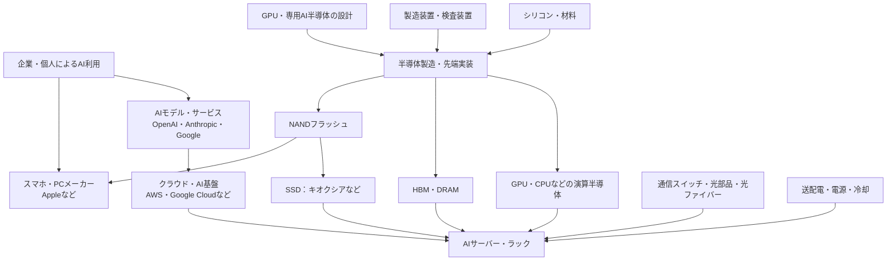

# AI関連銘柄をサプライチェーンで整理する

[調達の流れと43社の株価比較を開く](index.html)

調査日：2026-09-05。日本・海外を工程ごとに併記。国・地域は企業の本拠を基本とし、工場所在地や上場市場とは区別する。銘柄コードは日本株、米国ティッカー、台湾・韓国の現地コードを使用する。

**キオクシアは、記録媒体のNANDと、それを使った完成品SSDの両方を手がける企業。同じ領域で比較する海外企業はSandisk、Samsung Electronics、SK hynixグループ、Micron。GPUのすぐ近くで計算を支えるHBMとは、役割も競争相手の範囲も異なる。**

以下は確認できた製品・事業の分類と、それに基づく独自の投資論点。受注シェア、AI売上比率、個別顧客への供給契約を確認した一覧ではない。同じ行にあっても製品構成や競争力が同一とは限らない。

## 1. 全体のつながり

矢印は需要・製品・技術の関係を示す概念図。特定企業間の取引や製造委託を示さない。GPUなどのロジックと、DRAM・NANDでは製造ラインや工程が異なる。すべてが同じ工場で作られるわけではない。

## 2. 工程別の企業マップ

**【日本】と【海外／国・地域】を各社に表示。** 工程に該当する主要な日本企業が見当たらない場合は、無理に類似企業を入れない。各行の利益へのつながり・確認点は筆者の分析。

| 工程・役割 | 同じ領域の代表企業：日本・海外を併記 | AI需要が利益につながる経路／確認点 |
|---|---|---|
| 需要側：AIモデル・サービスを作り提供する | **Google／Gemini【海外／米国・親会社Alphabet GOOGL】、OpenAI／ChatGPT【海外／米国・非上場】、Anthropic／Claude【海外／米国・非上場】** | 利用者・企業のAI利用増加→学習・推論に必要な計算能力の調達増加。OpenAIとAnthropicは独立した上場株がない。Claudeは会社名ではなくAnthropicのサービス。[OpenAI](https://openai.com/index/building-the-compute-infrastructure-for-the-intelligence-age/)・[Anthropic](https://www.anthropic.com/news/anthropic-amazon-compute)・[Google Cloud](https://cloud.google.com/tpu) |
| 需要側：クラウド・AI基盤を運営する | **Amazon／AWS【海外／米国・AMZN】、Google Cloud【海外／米国・親会社Alphabet GOOGL】** | AIモデル企業や一般企業へ計算能力を提供し、サーバー・半導体・ネットワーク・電力・冷却を調達する。GoogleはGemini、クラウド、TPUを同じ企業グループ内に持つため複数工程に重複する。[AWS Trainium](https://aws.amazon.com/ai/machine-learning/trainium/)・[Google TPU](https://cloud.google.com/tpu) |
| 需要側：スマホ・PCなどの端末を設計・販売する | **Apple【海外／米国・AAPL】** | iPhone・iPad・MacなどへNAND・組み込みストレージを搭載する。Appleは2026年3月期にキオクシア売上の20.4%を占める最大顧客。クラウド→企業向けSSDの経路とは分け、Apple→NANDの端末向け経路として扱う。Apple向け売上のうちAI由来の比率は非開示。[キオクシア有価証券報告書](https://www.kioxia-holdings.com/content/dam/kioxia-hd/en-jp/ir/library/securities/asset/Annual-Securities-Report-FY2025-EN.pdf) |
| ① シリコンウェーハ：半導体の土台 | **信越化学【日本・4063】、SUMCO【日本・3436】、GlobalWafers【海外／台湾・6488】、Siltronic【海外／ドイツ・WAF】** | 半導体の生産量増加→ウェーハ需要。AI以外の用途も広く、AI好調でも一般半導体の在庫調整が響く。[製品根拠：SUMCO](https://www.sumcosi.com/products/lineup.html)・[信越化学](https://www.shinetsu.co.jp/wp-content/uploads/2022/07/Business-Activity.pdf)・[GlobalWafers](https://www.sas-globalwafers.com/en/products/)・[Siltronic](https://www.siltronic.com/en/) |
| ② 前工程装置：回路を形成する | **東京エレクトロン【日本・8035】、Lam Research【海外／米国・LRCX】、ASML【海外／オランダ・ASML】** | 東京エレクトロンとLamはエッチングなど、ASMLは露光。微細化・NAND多層化・能力増強が設備需要を生む。装置同士でも得意工程は異なる。NAND価格上昇と装置発注増加は同時とは限らない。[TEL](https://www.tel.com/news/product/2023/20230609_001.html)・[Lam](https://www.lamresearch.com/products/our-solutions/cryogenic-etching/)・[ASML](https://www.asml.com/en/news/press-releases/2024/asml-investor-day-2024) |
| ③ GPU・専用AI半導体の設計：計算する | **NVIDIA【海外／米国・NVDA】、AMD【海外／米国・AMD】、Broadcom【海外／米国・AVGO】** | NVIDIA・AMDはGPU、Broadcomは顧客向け専用AI半導体など。計算需要→販売数量・高機能化。GPUと専用半導体の構成比、ソフトウェア、顧客集中を確認。主要な直接比較対象は海外中心。[NVIDIA](https://www.nvidia.com/en-us/data-center/technologies/blackwell-architecture/)・[AMD](https://www.amd.com/en/products/accelerators/instinct.html)・[Broadcom](https://www.broadcom.com/solutions/ai-solutions/ai-infrastructure) |
| ④ 製造受託・先端実装：設計をチップにし、複数チップをつなぐ | **TSMC【海外／台湾・2330／米ADR TSM】、ASE Technology【海外／台湾・3711／米ADR ASX】** | TSMCは製造受託とCoWoSなど、ASEは組立・実装・テスト受託。競合領域と補完領域が混在。生産能力、歩留まり、設備償却、稼働率が重要。[TSMC](https://www.tsmc.com/english/dedicatedFoundry/services/advanced-packaging)・[ASE](https://ase.aseglobal.com/press-room/ase-and-wus-announce-strategic-expansion/) |
| ⑤ 実装材料・基板・加工：チップを載せる・薄くする | **味の素【日本・2802】、イビデン【日本・4062】、Unimicron【海外／台湾・3037】、ディスコ【日本・6146】** | 味の素はABF絶縁材料、イビデン・UnimicronはICパッケージ基板、ディスコは薄化・切断装置。相互に同業ではなく隣接工程。④の海外実装企業とつながる領域。大型基板、多層化、薄化の難度が需要を生む。各社全体への寄与率は別途確認。[UnimicronのIC基板製造認証（認証機関DQS）](https://www.dqsglobal.com/en/customer-database/unimicron-technology-corp.-ic-carrier-sbu7)・[味の素](https://www.ajinomoto.com/stories/the-ajinomoto-groups-unexpected-role-in-semiconductor-manufacturing-the-insulating-film-abf-born-from-aminoscience)・[イビデン](https://www.ibiden.com/ir/items/en_tougouhoukoku2024A4.pdf)・[ディスコ](https://www-hq.disco.co.jp/jp/ir/movie/doc/E_Tech_Briefing_2023.pdf) |
| ⑥ 半導体テスト装置：正常に動くか測る | **アドバンテスト【日本・6857】、Teradyne【海外／米国・TER】** | 複雑なAIチップやHBMの増加→テスト項目・時間・装置需要の増加。出荷個数だけでなく、1個当たりテスト負荷を見る。[Advantest](https://www.advantest.com/en/about/governance/risk-manage/tcfd/)・[Teradyne](https://www.teradyne.com/application-pages/ai/) |
| ⑦ HBM・DRAM：計算中のデータを高速に保持 | **SK hynix【海外／韓国・000660】、Micron【海外／米国・MU】、Samsung Electronics【海外／韓国・005930】** | GPU当たり搭載容量・帯域増加が需要を支える。HBMの世代、顧客認定、歩留まり、供給能力が重要。キオクシアはこの直接比較グループに入らない。[SK hynix](https://news.skhynix.com/en/sk-hynix-completes-worlds-first-hbm4-development-and-readies-mass-production/)・[Micron](https://www.micron.com/markets-industries/ai/ai-data-center)・[Samsung](https://semiconductor.samsung.com/dram/hbm/) |
| **⑧ 企業向けSSD：NANDを完成品ストレージにする** | **キオクシアHD【日本・285A】、Sandisk【海外／米国・SNDK】、Samsung Electronics【海外／韓国・005930】、SK hynix／Solidigm【海外／韓国グループ・000660】、Micron【海外／米国・MU】** | NAND、コントローラー、ファームウェアなどを組み合わせ、サーバーが利用できるSSDにする。データセット・モデル・KVキャッシュ・RAG・生成データの増加が容量と性能の需要につながる。[キオクシア](https://americas.kioxia.com/en-us/business/application/ai.html)・[Samsung](https://semiconductor.samsung.com/ssd/)・[Micron](https://www.micron.com/markets-industries/ai/ai-data-center) |
| **⑨ NANDフラッシュ：SSD内部でデータを記録** | **キオクシアHD【日本・285A】、Sandisk【海外／米国・SNDK】、Samsung Electronics【海外／韓国・005930】、SK hynix【海外／韓国・000660】、Micron【海外／米国・MU】** | SSDメーカーが記録媒体として調達する半導体。利益はNAND価格、ビット出荷量、ビット当たり原価、設備投資に左右される。キオクシアなどはNANDとSSDの両工程にまたがる。[Sandisk](https://investor.sandisk.com/news-releases/news-release-details/sandisk-celebrates-nasdaq-listing-after-completing-separation)・[SK hynix](https://news.skhynix.com/en/sk-hynix-to-establish-ai-solutions-arm-in-us/) |
| ⑩ AIサーバー・ラック：部品を組み合わせる | **富士通【日本・6702】、NEC【日本・6701】、Dell【海外／米国・DELL】、HPE【海外／米国・HPE】、Supermicro【海外／米国・SMCI】、Lenovo【海外／香港・0992】、NVIDIA【海外／米国・NVDA】、Quanta【海外／台湾・2382】、Wiwynn【海外／台湾・6669】、Hon Hai／Foxconn【海外／台湾・2317】** | GPU・CPU・HBM・DRAM・SSD・ネットワーク・冷却を組み合わせる。ブランドOEM、NVIDIAのDGX、クラウド向けODMでは販売方法と利益構造が異なる。売上に高額GPUの仕入れが含まれるため、売上成長だけでなく粗利益・運転資金・顧客構成を確認。[富士通](https://www.fujitsu.com/jp/products/computing/servers/primergy/solution/private-ai-platform/)・[NEC](https://jpn.nec.com/gpu/index.html)・[Dell](https://www.dell.com/en-us/shop/poweredge-ai-servers/sf/poweredge-ai-servers)・[HPE](https://www.hpe.com/emea_europe/en/compute/ai-servers.html)・[Supermicro](https://www.supermicro.com/en/accelerators/nvidia)・[Lenovo](https://pubs.lenovo.com/ai-solution)・[NVIDIA DGX](https://docs.nvidia.com/dgx-systems/index.html)・[Quanta／QCT](https://go.qct.io/wp-content/uploads/2025/06/NV-Leaflet_20250517.pdf)・[Wiwynn](https://www.wiwynn.com/hubfs/Investors/Shareholders_Services/2026_Annual_Report_EN.pdf)・[Hon Hai](https://www.honhai.com/en-us/press-center/press-releases/latest-news/2044) |
| ⑪ ネットワーク：多数のGPU・サーバーを接続 | **Broadcom【海外／米国・AVGO】、Arista Networks【海外／米国・ANET】、NVIDIA【海外／米国・NVDA】** | Broadcomはスイッチ半導体など、AristaはEthernetスイッチシステム、NVIDIAはNVLinkやネットワーク製品。接続速度・ポート数増加が需要につながる。規格変更と顧客構成を確認。[Broadcom](https://www.broadcom.com/topics/what-is-networking-for-ai)・[Arista](https://www.arista.com/assets/data/pdf/Whitepapers/AI-Network-WP.pdf)・[NVIDIA](https://perspectives.nvidia.com/networking/) |
| ⑫ 光通信：データを光にして運ぶ | **フジクラ【日本・5803】、Coherent【海外／米国・COHR】、Lumentum【海外／米国・LITE】** | フジクラは光ファイバー・配線、Coherent・Lumentumは光部品・光トランシーバーなど。同じ光通信でも役割は違う。高速化、配線密度、光電変換の方式変更を確認。[フジクラ](https://www.optic-product.fujikura.com/jp/data-center-solution/)・[Coherent](https://www.coherent.com/communications/datacom/cloud-networking)・[Lumentum](https://www.lumentum.com/products/16t-2dr4-tro-osfp-transceiver-module) |
| ⑬ 電力供給・配電：データセンターを動かす | **日立製作所【日本・6501】、Eaton【海外／アイルランド登記・ETN】、Vertiv【海外／米国・VRT】** | 日立はHitachi Energyを通じた変圧器など、Eatonは配電・電源、VertivはUPS・ラック配電など。部位の違いに注意。必要電力、受注残、納期、設備の稼働開始を追う。Eatonは米国事業基盤が大きい。[日立](https://www.hitachienergy.com/us/en/products-and-solutions/transformers/by-customer-segment/transformers-for-data-centers)・[Eaton](https://www.eaton.com/us/en-us/markets/data-centers/impact-of-ai-data-center-infrastructure/managing-ai-power-requirements.html)・[Vertiv](https://www.vertiv.com/en-ca/solutions/ai-hub/design/infrastructure-designed-to-move-as-one/) |
| ⑭ 冷却：熱を外へ逃がす | **ダイキン工業【日本・6367】、Vertiv【海外／米国・VRT】** | ダイキンは大型空調・冷熱源など、Vertivはデータセンター冷却・液冷など。施設側冷却とチップ側液冷は補完関係もある。液冷化がすべての空調企業に同じ利益をもたらすわけではない。[ダイキン](https://www.daikin.com/about/corporate/tic/topics/feature/2026/20260630)・[Vertiv](https://www.vertiv.com/en-us/solutions/360ai/) |

AIサーバーを売る会社はDellだけではない。画面では同じ「AIサーバー・ラック」工程にまとめるが、投資比較では次の3種類を分けて見る。

| 種類 | 代表企業 | 主な顧客と役割 |
|---|---|---|
| ブランドOEM・インテグレーター | 富士通、NEC、Dell、HPE、Supermicro、Lenovo | 企業・官公庁・研究機関・クラウド事業者へ、自社ブランドのGPUサーバー、保守、導入支援を提供する |
| 半導体・プラットフォーム企業の完成システム | NVIDIA | GPUに加え、DGXやラックスケールシステムを設計・販売する。GPU単体の供給と同じ役割ではない |
| ODM・製造／統合企業 | Quanta、Wiwynn、Hon Hai／Foxconn | ハイパースケーラーやブランド企業の仕様に沿ってサーバー・ラックを設計、製造、統合する。最終顧客の画面にはODM名が出ないことも多い |

このためDellの売上だけでAIサーバー市場全体を測れない。企業向けのブランド販売、クラウド向けODM出荷、NVIDIAのプラットフォーム販売を分け、各社のAIサーバー売上・受注残・粗利益・顧客集中を見る必要がある。

OpenAI、Anthropic、Googleは同じ需要側でも立場が異なる。OpenAIはAzureやOracle Cloudを含む外部パートナーとStargate基盤を構築し、AnthropicはAWSを主要な学習・クラウド基盤としながらGoogle CloudのTPUも利用する。GoogleはGeminiを提供し、その学習・推論基盤となるGoogle CloudとTPUを自社グループで持つ。モデル企業がサーバーをすべて直接購入するとは限らず、クラウド利用契約や専用データセンター計画を通じて需要が設備側へ流れる。[OpenAI](https://openai.com/index/building-the-compute-infrastructure-for-the-intelligence-age/)・[AnthropicとAWS](https://www.anthropic.com/news/anthropic-amazon-compute)・[AnthropicとGoogle Cloud](https://www.anthropic.com/news/expanding-our-use-of-google-cloud-tpus-and-services)・[Google Cloud](https://cloud.google.com/tpu)

AWSとGoogle CloudはGPUを利用するだけでなく、Trainium、TPUという専用半導体も展開する。したがって「AI利用増加がすべてNVIDIAのGPU売上になる」とは置かない。[AWS](https://aws.amazon.com/ai/machine-learning/trainium/)・[Google Cloud](https://cloud.google.com/tpu)

## 3. キオクシアと同じ事業の海外企業

NANDはデータを記録する半導体。SSDはNANDにコントローラーやファームウェアなどを組み合わせた製品。NANDを作る会社と、他社のNANDを買ってSSDを組み立てる会社は区別する。

| 企業 | 国・地域／投資対象 | キオクシアと重なる事業 | 比較するときの違い |
|---|---|---|---|
| **キオクシアHD** | **日本／285A** | NAND製造、企業・データセンター・PC向けSSDなど | NAND・フラッシュ中心。NANDの市況、原価、企業向けSSDへの転換を見たい |
| **Sandisk** | **海外・米国／SNDK** | NAND、SSD、フラッシュ製品 | フラッシュ中心という点で、事業構成上とくに近い比較対象。キオクシアと製造合弁を持つため、販売面の競合であり製造面のパートナーでもある |
| **Samsung Electronics** | **海外・韓国／005930** | NAND、データセンター・企業向けSSD | DRAM・HBMなども扱う総合企業。NAND部門が似ていても、会社全体の利益構成は大きく異なる |
| **SK hynixグループ／Solidigm** | **海外・韓国グループ／000660。Solidigmは米国のグループ企業** | NAND、企業向けSSD | HBM・DRAMとNANDの両方を見る必要がある。Solidigmを別の独立上場銘柄として扱わない |
| **Micron** | **海外・米国／MU** | NAND、データセンター向けSSD | HBM・DRAMも展開。NANDの回復とHBMの成長が同時に株価材料になり得る |

事業の根拠は上表⑦〜⑨の公式資料。**Sandiskは2025年2月24日に独立上場を発表しており、古いWestern Digital一体時代の比較表をそのまま使わない。** キオクシアとの四日市合弁は2026年1月29日に2034年までの延長を発表。[上場発表](https://investor.sandisk.com/news-releases/news-release-details/sandisk-celebrates-nasdaq-listing-after-completing-separation)・[合弁延長](https://www.sandisk.com/company/newsroom/press-releases/2026/2026-01-29-kioxia-and-sandisk-extend-yokkaichi-joint-venture-agreement-through-2034)

競争環境を見るなら中国の**YMTC【海外・中国】**も含める。同社公式サイトで3D NAND製品を確認した。ただし本資料では投資可能な上場銘柄としての確認をしていないため、競合監視対象とする。[YMTC製品](https://www.ymtc.com/en/productlist.html?cat=33)

### HBM・DRAM・SSD・NANDは何が違うか

| 層 | 主な役割 | 代表企業 |
|---|---|---|
| HBM | GPUに近い、高帯域の作業用メモリ。計算中のデータを高速にやり取り | SK hynix、Micron、Samsung |
| サーバーDRAM | CPUの主記憶など。GPU以外も含むシステムの作業領域 | SK hynix、Micron、Samsung |
| 企業向けSSD | NAND、コントローラー、ファームウェアなどを組み合わせた完成品。サーバーから読み書きする | **キオクシア**、Sandisk、Samsung、Solidigm、Micron |
| NANDフラッシュ | SSDや組み込みストレージ内部の記録媒体。電源を切ってもデータを保持 | **キオクシア**、Sandisk、Samsung、SK hynix、Micron |

Micronの公式説明も、HBMをAIアクセラレーターの帯域、DRAMをサーバー作業用メモリ、SSDをデータセット・モデルへのアクセスとして分けている。[Micron](https://www.micron.com/markets-industries/ai/ai-data-center)

**推論が増えるとSSDの役割が広がる、というのがキオクシアをAIと結びつける注目点。** ただし、これは需要経路の説明で、直近の株価上昇の原因を特定したものではない。

キオクシアは2026年3月16日、GPUからフラッシュへ直接アクセスするGP Seriesの開発を発表した。同発表時点の計画は2026年末までの一部顧客向け評価サンプル提供。これはHBMを補完する階層の提案であり、「HBMをNANDですべて置換する」「量産利益が既に確定した」とは解釈しない。本調査では当該製品のその後の量産・売上実績は確認していない。[キオクシア公式発表](https://americas.kioxia.com/en-us/business/news/2026/ssd-20260316-1.html)

## 4. 同じAI関連でも利益の出方が違う

以下は独自の分析枠組みであり、会社の業績予想や外部アナリスト予想ではない。

| 型 | 例 | 見る指標 | 見落としやすい点 |
|---|---|---|---|
| 技術・製品構成が効く | NVIDIA、HBM各社、先端実装 | 製品世代、顧客認定、粗利益率、歩留まり | 強い需要があっても競合の追随・顧客の内製化で取り分が変わる |
| 市況と原価が効く | キオクシア、SandiskなどNANDメーカー | NAND平均販売価格、ビット出荷量、ビット原価、在庫 | AI向けSSD好調でも、NAND全体の供給過剰で利益が落ち得る |
| 設備投資と工程の難度が効く | TEL、Lam、ASML、ディスコ、アドバンテスト | 顧客設備投資、受注、納期、検収、稼働率 | 顧客は値上がり局面でも増産を抑える場合がある |
| 接続量・速度が効く | フジクラ、Coherent、Arista | ポート数、接続速度、製品構成、顧客集中 | 光ファイバー、光部品、スイッチは別の市場。方式変更の影響も違う |
| 設備建設・電力密度が効く | 日立、Eaton、Vertiv、ダイキン | 受注残、利益率、稼働開始日、必要電力 | 電力接続の遅れは、建設・サーバー導入全体を遅らせる |

キオクシアの基本的な確認順序は、**SSD需要→NAND需給→販売価格と原価の差→設備投資後に残るキャッシュ**。需要が増えても、利益とキャッシュが同じ比率で増えるとは限らない。

また、NANDはDRAM・HBMと別の製造工程。HBM投資が増えることからNANDの供給減少を自動的に導かず、各社の資本配分・設備計画を確認する必要がある。

## 5. 次に企業比較するなら

1. **企業向けSSDとNANDの比較：キオクシアとSandisk。** SSD製品構成、NANDのビット成長、販売価格、原価、設備投資、財務負担を同じ期間で比較する。
2. **メモリ内の比較：上記にMicron・SK hynix・Samsungを追加。** 全社PERだけでなく、NANDとDRAM・HBMの利益構成を分ける。
3. **異なる工程との比較：アドバンテスト、フジクラ、Vertivなど。** NAND市況、半導体テスト、通信、電源・冷却という異なる業績要因を比較する。

これは調査順序で、推奨順位ではない。複数工程の銘柄を持っても、最終需要が同じクラウド設備投資に集中していれば、AI投資減速時には一緒に影響を受ける。銘柄数だけで分散を判断しない。

## 6. 株価比較画面のEPS・PER

[比較画面](index.html?tab=stock-comparison)では、工程ごとに選択した会社の四半期・通期・TTM EPSと、実績・予想PERを株価チャートの下に表示する。実績PERは株価÷TTM EPS、予想PERは株価÷アナリスト予想EPSとして提供元に保存された実数履歴。EPSは通貨／株の実数を会社別の目盛で表示する。いずれも100への指数化はしない。詳細な取得元、収録数、欠損の扱い、株式分割調整は[調査説明](README.md#epsperデータの基準)に記録した。

キオクシアの提供元TTM EPSは2026年3月期で更新が止まっていたため、2026年7月31日の公式第1四半期決算を反映して補正した。2026年9月3日時点では、実績PER約20.7倍に対し予想PER約5.5倍。後者から逆算される予想EPSは約9,445円で、会社の通期予想ではなく提供元のアナリスト予想に相当する。キオクシアはメモリー市況の変動が大きいため、低い予想PERだけで割安とは判断しない。

## 出典・日付と調査範囲

- **全リンクの参照日：2026-09-05。** 日付なしの製品・事業ページは、参照時点の会社説明として使用。市場シェアや性能の「世界一」などの宣伝文句は比較根拠として採用していない。
- 日付のある主な資料：TELの3D NANDエッチング開発（2023-06-09）、ディスコTech Briefing 2023、イビデン統合報告書2024、ASML Investor Day（2024-11-14）、Sandisk独立上場（2025-02-24）、SK hynix HBM4開発・量産体制発表（2025-09-12）、キオクシア／Sandisk合弁延長（2026-01-29）、キオクシアGP Series開発（2026-03-16）、ダイキン冷却技術記事（2026-06-30）。古い資料は工程・事業の説明に限定し、現在の受注や供給能力の証明には使っていない。
- 製品の存在・会社発表と、筆者の利益感応度・調査順序の解釈を区別。この文章レポートでは最新決算の横比較、目標株価、顧客別シェア、非公開契約は調査対象外。[比較画面](index.html)には、別途取得した株価履歴、EPS、実績PER、予想PERの固定履歴を掲載。予想PERは提供元のアナリスト予想に基づくため、実績値と区別する。
- [既存キオクシア調査](../../../companies/285A-kioxia/2026-09-05/README.md)の投資判断・価格・予想は更新も転載もしていない。[既存光通信資料](../../photonics/2026-09-05/README.md)も別スナップショットとして維持する。
