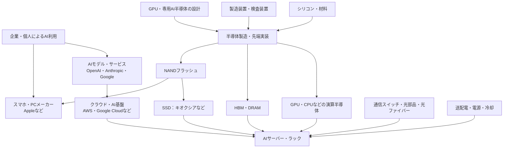

# AI関連銘柄をサプライチェーンで整理する｜2026-10-03

[調達の流れと43社の株価・PER・EPS比較を開く](index.html) · [調査範囲・出典方針](README.md) · [前回版（2026-09-05）](../2026-09-05/report.md)

調査日：2026-10-03。株価は各取引所の2026-10-02（休場銘柄は直前の取引日）終値。前回版と同じ17工程・上場43社を対象に、2026-09-05以降の1か月で変わった点を工程別に書き直した。

**記号の約束**
- 【実績】決算・公表済みの数値
- 【会社予想】会社のガイダンス
- 【外部予想】調査会社・アナリストの予想
- 【報道】報道ベースで、一次資料を照合できていないもの（未確認）
- 【独自】筆者の解釈・シナリオ

株価・EPSは、**2026-10-02時点の株式分割後の株数基準・各社の現地通貨**で表記する（換算した場合は独自計算と明記）。記載日時点の調査見解であり、売買の推奨ではない。

---

## 要点

1. **メモリーの好況は「価格」主導でさらに一段強まった。**
   - Micronの2026年6〜8月期は売上高542億ドル、GAAP粗利率86.8%。9〜11月期の会社予想は売上高615億ドル±15億ドル【実績・会社予想／Micron 2026-09-30】。
   - TrendForceは、2026年10〜12月期の契約価格を汎用DRAM＋10〜15%、NAND＋15〜20%と予想【外部予想／2026-09-30】。
   - 前回「NANDは供給過剰で利益が落ち得る」としたリスクは、少なくとも足元では顕在化していない。
2. **ただしNANDでは「値上げの打ち止め」発言が出た。**
   - キオクシアの太田社長が、データセンター顧客への追加値上げ要求を止めるよう営業に指示したと報じられた【報道／Bloomberg経由 Japan Times 2026-09-10】。
   - 前回の確認順「SSD需要→NAND需給→販売価格と原価の差」のうち、**価格の伸びが鈍る局面の入口**に入った可能性を示す最初のシグナルとして扱う【独自】。
3. **需要側の設備投資は「減額ゼロ」のまま、資金調達の重さが論点になった。**
   - Oracleは受注残（RPO）6,640億ドル、四半期の設備投資285億ドルで、フリーキャッシュフローは約マイナス50億ドル【実績／Oracle 2026-09-10】。
   - OpenAI・Anthropicの巨額の計算資源契約と資金調達の報道が続き、「需要はあるが誰がどう払うか」が株価の変動要因になった【独自】。
4. **9月中旬に「AI開発ペース抑制」論で半導体株が急落し、その後回復した。**
   - AnthropicのAmodei CEOのエッセイ（2026-09-12）を受け、9/14にMicron −3.9%、SK hynix 5%超安など【実績／報道集計】。
   - 月末にかけて戻した。9/4→10/2では装置・テスト・基板・光部品の上昇が大きい。一方、NVIDIA（+1.6%）、Broadcom（−0.8%）、Sandisk（−1.2%）は横ばい圏【実績／Yahoo Finance終値】。
5. **株価の上昇は、川上（装置・テスト・基板・ウェーハ）と光通信へ広がった。**
   - 9/4→10/2の上昇：Unimicron +44.7%、Teradyne +25.8%、Lumentum +23.2%、ASE・GlobalWafers 各+21.3%、イビデン +18.2%、アドバンテスト +16.7%。
   - 日本の半導体製造装置の8月販売高は前年比+47.4%【実績／SEAJ 2026-09-23】。
   - 一方、ODMのWiwynn（−18.7%）、Vertiv（−10.1%）、Amazon（−2.7%）は下落した。
6. **10月1日に3社が株式分割した。**
   - キオクシアが1対3、東京エレクトロンが1対5、イビデンが1対2（いずれも権利落ち2026-09-29）。
   - 比較画面ではEPSも分割後の株数にそろえた。分割前の株価・EPSと直接比べないこと。
7. **マクロの逆風が増えた。**
   - 9/16のFOMCで0.25%の利上げ（誘導目標3.75〜4.00%）と報じられた【報道／要約で確認、一次資料は未照合】。高PER銘柄の多いAI関連にとっては割引率の上昇要因。
   - 米国の半導体関税「第2弾」が予告されたとの報道もあるが、正式な布告は確認できていない【報道・未確認】。

## 前回（2026-09-05版）からの変化

前回の文章レポートは工程分類と需要経路の整理が中心で、最新決算の横比較は対象外だった。今回は、前回本文の「確認点・見落としやすい点」を基準に比較した。

| 論点 | 前回（2026-09-05）の見立て | 2026-10-03時点で分かったこと | 評価【独自】 |
|---|---|---|---|
| AI需要全体 | AI利用増→クラウド・モデル企業の調達増。ただし需要が同じクラウド設備投資に集中する | 大手クラウドの2026年設備投資の指針は7月時点から据え置きで、減額した会社はない【会社予想／二次集計 2026-09-16】。Oracleは受注残6,640億ドル、2027年5月期の設備投資は総額最大約950億ドル【実績・会社予想】。AnthropicはAkamaiと7年116億ドル（最大200億ドル）の契約【実績／Akamai 2026-09-24】 | 需要の強さは継続。一方、フリーキャッシュフローがマイナスの設備投資や、資金調達を前提にした契約が増え、**需要の「質」と資金繰り**の確認が必要になった |
| GPU・専用AI半導体 | 「AI需要がすべてNVIDIAの売上になる」とは置かない | Broadcomの2026年5〜7月期のAI半導体売上は167億ドル（前年比+221%）、8〜10月期の会社予想は217億ドル【実績・会社予想】。決算説明会では、Anthropicが最大のXPU顧客になる見込みとした【会社説明／報道】。NVIDIAは1,500億ドルの自社株買い枠を追加【実績／2026-09-28】 | 専用半導体（TPU・XPU）の伸びが鮮明になり、前回の「分散」の見立てを補強した。株価は9/4→10/2でNVIDIA +1.6%、Broadcom −0.8%、AMD +32.7%と分かれた |
| HBM・DRAM | 世代・認定・歩留まり・供給能力が重要 | Micronの直近四半期のGAAP粗利率は86.8%【実績】。TrendForceは2027年のHBM平均単価を前年比+121%に上方修正し、ビット出荷+50〜60%でも需要に届かないとした【外部予想／2026-09-29】。HBM4の16層品はSK hynixが量産出荷との報道【報道・未確認】 | 供給不足は2027年まで続くとの見方が強まった。リスクは「需要減」よりも「価格の伸びの鈍化」と「設備投資の急増」に移りつつある |
| NAND・企業向けSSD（キオクシア） | AI向けSSDが好調でも、NAND全体の供給過剰で利益が落ち得る。低い予想PERだけで割安とは判断しない | 4Q26のNAND契約価格は+15〜20%予想で、企業向けSSDだけが上昇を加速【外部予想】。企業向けSSDのビット需要は2026年に前年比+80%超【外部予想】。キオクシア社長の「値上げ打ち止め」発言【報道】。キオクシアのTTM実績PERは23.2倍、予想PERは5.8倍（9/18、提供元）【独自計算・外部予想】 | 足元の需給はむしろ強い。次の焦点は**価格の伸びの鈍化**がいつ数字に出るか。予想PERの低さは前回同様、ピーク利益の織り込みとみる |
| 製造装置・テスト | 値上がり局面でも顧客が増産を抑える場合がある | SEMIの2026年4〜6月期の世界装置出荷額は405億ドル（前年比+23%）、日本製装置の8月販売高は前年比+47.4%【実績】。Micronは2027年度の設備投資を従来計画から増額すると表明【会社予想】 | 前回の慎重シナリオ（増産抑制）より、**能力増強へ動き始めた**証拠が増えた。装置株の上昇はこれを先取りしている。半面、メモリー各社の増産はいずれ価格の重しになる |
| 先端実装・基板 | 大型基板・多層化・薄化の難度が需要を生む | ASEの8月売上高は前年比+45.7%【実績】。ABF基板の不足が長期化するとの報道があるが、9月の新規開示は未確認【報道】 | 株価はUnimicron +44.7%、イビデン +18.2%で、最も強い工程の一つ。期待先行の度合いも大きい |
| 光通信 | 高速化・配線密度・方式変更を確認 | Lumentumの2026年4〜6月期の売上高は10.1億ドル（前年比約2倍）、7〜9月期の会社予想は12.25〜12.75億ドル【実績・会社予想／2026-08-11】。フジクラは5月高値から大きく調整した後に反発【報道】 | 需要の強さは継続。ただしTTM実績PERはフジクラ59倍、Coherent 82倍で、評価はすでに高い |
| 電力・冷却 | 電力接続の遅れが建設全体を遅らせる | 日立（Hitachi Energy）が米国に5.28億ドルの変圧器工場【実績／2026-09-16】。Eatonが成長見通しを引き上げたとの報道【報道】。Vertivが液冷サービス会社を買収【実績／2026-09-25】 | 受注は強いが、株価はVertiv −10.1%、ダイキン +0.4%と相対的に弱い。期待の織り込みと金利上昇が重しとみる |
| マクロ・規制 | （前回は対象外） | FOMCの利上げ【報道】、米国の半導体関税第2弾の予告【報道・未確認】、米中首脳会談（9/24）では半導体の輸出規制が議題外【報道】 | 金利上昇と関税の不確実性が、高PER銘柄の下振れ要因に加わった |

---

## 1. 全体のつながり（前回から変更なし）

- 矢印は需要・製品・技術の関係を示す概念図で、特定企業間の取引を示さない。
- 工程ごとの企業の役割と、製品の根拠になる公式資料は、[前回版の工程別企業マップ](../2026-09-05/report.md#2-工程別の企業マップ)を引き継ぐ。
- 今回、企業の追加・削除はしていない。

---

## 2. 工程別の考察（2026-10-03時点）

各工程は「事実→注目点→投資上の論点→リスク」の順で書く。株価の騰落率は、Yahoo Financeの終値（株式分割調整後・配当なし）から計算した2026-09-04→2026-10-02の値【実績・独自計算】。

### 需要側：AIモデル・クラウド・端末（OpenAI、Anthropic、Alphabet、Amazon、Apple）

**事実**
- 大手クラウドの2026年の設備投資指針（7月下旬の4〜6月期決算時点）。9月中に減額した会社はない【会社予想／二次集計 supercyclehq 2026-09-16、各社IR原文は未照合】。
  - Amazon：約2,200億ドル
  - Alphabet：1,950〜2,050億ドル
  - Meta：1,300〜1,450億ドル
  - Microsoft：2026年7〜9月期だけで500億ドル超
- Oracleの2026年6〜8月期【実績／[Oracle 8-K](https://www.sec.gov/Archives/edgar/data/0001341439/000119312526387905/orcl-ex99_1.htm) 2026-09-10】
  - 売上高193億ドル（前年比+30%）、うちOCI 74億ドル（+121%）
  - 受注残（RPO）6,640億ドル
  - 設備投資285億ドル、フリーキャッシュフロー約マイナス50億ドル
  - 2027年5月期の設備投資は総額最大約950億ドル【会社予想】
- Anthropic
  - Akamaiと7年116億ドル（最大200億ドル）の契約【実績／[Akamai](https://www.globenewswire.com/news-release/2026/09/24/3368729/0/en/akamai-announces-11-6-billion-multi-year-agreement-with-anthropic-to-support-growing-demand.html) 2026-09-24】
  - Lambdaとの350億ドル契約、IPOの検討【報道・未確認】
- OpenAIは評価額約1.4兆ドルで、300億ドル以上の資金調達を検討と報じられた【報道・未確認／Bloomberg 2026-09-29】。
- 株価（9/4→10/2）：Alphabet +1.5%、Amazon −2.7%、Apple +4.3%

**注目点**：計算資源を使う側の株価は、供給側より伸びが小さい。設備投資の負担と、AIの収益化のペースの差が意識されているとみる【独自】。

**投資上の論点**：需要側の設備投資が減額されない限り、供給側の受注は続く。確認する点は次の3つ【独自】。
- Oracleのように、フリーキャッシュフローがマイナスの投資が続くか
- 非上場のモデル企業が資金を調達できるか
- 10月下旬からの大手クラウドの7〜9月期決算で、2027年の設備投資の初期見通しがどう示されるか

**リスク**
- AIモデル企業の資金調達が滞ると、クラウド経由の需要見通しが一斉に修正される。
- 「開発ペース抑制」論（9/12）のように、需要側の発言で供給側の株価が大きく動く。

### ① シリコンウェーハ（信越化学、SUMCO、GlobalWafers、Siltronic）

**事実**
- UBSは、300mmウェーハの稼働率が2026年の84%から2028年に99%へ上がり、新規増産には40〜50%超の値上げが必要とみる【外部予想／UBSレポートの報道 2026-09-18】。
- 株価（9/4→10/2）：GlobalWafers +21.3%、SUMCO +11.1%、信越化学 +4.2%、Siltronic +0.7%
- SUMCOとSiltronicは、直近TTMのEPSが赤字【実績／提供元】。

**注目点**：AI向け先端品が全体の需要を押し上げる一方、汎用品の回復は途上。赤字企業の株価が先行して上がっている【独自】。

**投資上の論点**：稼働率の上昇から値上げまでは2027〜28年とみられ、株価は回復を先取りしている。PERより、稼働率と長期契約の価格を確認したい【独自】。

**リスク**：汎用半導体（車載・産業）の在庫調整の長期化、値上げの遅れ。

### ② 前工程装置（東京エレクトロン、Lam Research、ASML）

**事実**
- SEMIによると、2026年4〜6月期の世界の装置出荷額は405億ドル（前年比+23%、2四半期連続で過去最高）【実績／SEMI 2026-09-03】。
- 日本製装置の8月の販売高（3か月移動平均）は5,979億円（前年比+47.4%）【実績／SEAJ、[ニュースイッチ](https://newswitch.jp/p/50331) 2026-09-23】。
- ASMLとTSMCが、High-NA EUV向けの大型フォトマスクへの移行で協業【会社発表／ASML 2026年9月】。
- 東京エレクトロンは1対5の株式分割（効力発生2026-10-01、権利落ち9/29）。
- 株価（9/4→10/2、分割調整後）：東京エレクトロン +13.5%、Lam +12.9%、ASML +8.9%

**注目点**：メモリーの増産投資が、装置の需要へ波及し始めた。
- Micronは2027年度の設備投資を増額【会社予想】。
- SamsungはHBM向けのウェーハ投入を約4割増やす計画と報じられた【報道】。

**投資上の論点**
- 前回は「値上がり局面でも顧客が増産を抑える」リスクを挙げた。今回は増産へ向かう材料が増え、装置株には追い風【独自】。
- 予想PERはすでに高い成長を織り込んでいる：東京エレクトロン約32倍、Lam約34倍、ASML約29倍（9月中旬〜下旬、提供元）。

**リスク**
- 中国向け売上の規制強化
- メモリー価格のピークアウトによる、増産投資の撤回
- Lam Researchの次回決算（2026-10-21予定）での受注見通し

### ③ GPU・専用AI半導体（NVIDIA、AMD、Broadcom）

**事実**
- NVIDIA
  - 2026年5〜7月期の売上高は962億ドル（前年比+106%）【実績／[NVIDIA](https://nvidianews.nvidia.com/news/nvidia-announces-financial-results-for-second-quarter-fiscal-2027) 2026-08-26】。
  - 8〜10月期の会社予想は1,080億ドル±2%。中国向けデータセンター売上はゼロが前提【会社予想】。
  - 9/28に自社株買い枠1,500億ドルを追加【実績】。
  - Vera Rubin NVL72ラックの出荷開始が報じられた【報道・未確認】。
- Broadcom【実績・会社予想／2026年9月上旬。公式リリースは取得タイムアウトのため、二次報道で確認】
  - 2026年5〜7月期のAI半導体売上は167億ドル。
  - 8〜10月期の会社予想は217億ドル。
  - 決算説明会で、2027年度のAI売上1,150億ドルの見通しが示されたと報じられた【報道】。
- AMDは、MI450・Heliosの量産出荷が9月末に始まるとした【会社説明／発言日は未確認】。
- 株価（9/4→10/2）：AMD +32.7%、NVIDIA +1.6%、Broadcom −0.8%

**注目点**：TPU・XPUなどの顧客専用半導体と、AMDのラック製品が立ち上がり、NVIDIA一強からの分散が数字に出始めた【独自】。

**投資上の論点**
- 予想PER（9/22〜23、提供元）【外部予想ベース】：NVIDIA約25倍、Broadcom約19倍、AMD約40倍。
- AMDは、実績に対する期待の比率が最も高い。
- Broadcomは株価が横ばいで、予想PERが低下した。

**リスク**
- 顧客の集中：AnthropicやOpenAIの計算資源計画の変更が、そのまま受注に響く。
- 中国向け輸出の不確実性
- 金利上昇によるバリュエーションの低下

### ④ 製造受託・先端実装（TSMC、ASE）

**事実**
- TSMCの8月売上高は5,148億台湾ドル（前年比+53.3%）【実績／[TSMC](https://pr.tsmc.com/english/news/3340) 2026-09-10】。
- ASEの8月売上高は822億台湾ドル（前年比+45.7%、過去最高）【実績／2026-09-10頃】。
- 株価（9/4→10/2）：ASE +21.3%、TSMC +3.7%

**注目点**：CoWoSなど先端実装の能力不足を、ASEなどの外部委託（OSAT）が補う構図が続く。9月中に、新しい能力増強の公式発表は確認できなかった。

**投資上の論点**：TSMCは予想PER約19倍で、AI関連の大型株の中では相対的に落ち着いた評価。ASEはTTM実績PERが約55倍まで上昇した【独自計算】。

**リスク**：米国の半導体関税（第2弾の報道は未確認）、台湾の地政学、海外工場のコスト。

### ⑤ 実装材料・基板・加工（味の素、イビデン、Unimicron、ディスコ）

**事実**
- ABF基板の不足が長期化するとの報道は8月以前のもので、9月の個社の新規発表は確認できなかった【報道・未確認】。
- イビデンは1対2の株式分割（効力発生2026-10-01）。
- ディスコの7〜9月期の出荷額の会社計画は1,410億円で、過去最高の見込み【会社予想／2026-07-23】。実績は未発表。
- 株価（9/4→10/2、分割調整後）：Unimicron +44.7%、イビデン +18.2%、ディスコ +10.7%、味の素 +0.7%

**注目点**：基板は、全工程で最大級の上昇率。年初来ではUnimicronが約5.9倍、イビデンが約3.6倍【実績】。

**投資上の論点**
- TTM実績PERは、イビデン約113倍、Unimicron約86倍【独自計算】で、将来の増産と値上げを強く織り込んでいる。
- 利益の伸びがこの株価を正当化するかは、2026年10〜11月の決算で検証が必要【独自】。

**リスク**
- 増産投資の完了後の供給過剰（前回の確認時点で、両社合計50億ドル超の報道）
- 顧客の設計変更（ガラス基板など）

### ⑥ 半導体テスト装置（アドバンテスト、Teradyne）

**事実**
- Teradyneは東京エレクトロンと、AIチップレット向けの統合テストセルを発表。9/29にはメモリーテスターの新製品を発表【会社発表】。
- アドバンテストの2027年3月期の会社予想は、7月に上方修正済み（売上高1兆7,140億円）【会社予想／報道経由】。次回決算は10/28。
- 株価（9/4→10/2）：Teradyne +25.8%、アドバンテスト +16.7%

**注目点**：HBMや大型AIチップは、1個当たりのテスト時間が長い。メモリーテスターの需要はHBMの増産と連動しやすい【独自】。

**投資上の論点**：アドバンテストはTTM実績PERが約75倍、予想PERが約36倍。10/28の決算で、会社予想がさらに上方修正されるかが焦点。

**リスク**：AIチップの顧客の集中、メモリーの設備投資の循環。

### ⑦ HBM・DRAM（SK hynix、Micron、Samsung Electronics）

**事実**
- Micron【実績・会社予想／[Micron 8-K](https://www.sec.gov/Archives/edgar/data/0000723125/000072312526000018/a2026q4ex991-pressrelease.htm) 2026-09-30】
  - 2026年6〜8月期：売上高542.3億ドル、GAAP粗利率86.8%、GAAP EPS 32.87ドル
  - 2026年8月期の通期GAAP EPSは74.33ドル
  - 9〜11月期の会社予想：売上高615億ドル±15億ドル、GAAP EPS 37.84ドル±1.00ドル
  - 2027年度の設備投資は、従来計画から増額【会社予想、金額は未確認】
- TrendForceの予想【外部予想】
  - 4Q26の汎用DRAM契約価格は前四半期比+10〜15%（2026-09-30）
  - 2027年のHBM平均単価は前年比+121%（2026-09-29）
- Samsungは、2027年にHBMが業界のDRAMウェーハ能力の約30%を占めるとみていると報じられた【報道／TrendForce 2026-09-29】。
- 7〜9月期の営業利益コンセンサス（FnGuide）は、Samsung 110.3兆ウォン、SK hynix 78.1兆ウォン【外部予想／2026-09-30】。
- 株価（9/4→10/2）：SK hynix +11.8%、Samsung +8.0%、Micron +5.7%

**注目点**
- 提供元のMicronのTTM EPSは、2026年5月期の44.24ドルで止まっている。公式の通期GAAP EPS 74.33ドルで計算すると、実績PERは約14.5倍【独自計算：1,074.89÷74.33】。
- 予想PERはMicron約7倍、SK hynix・Samsung約4倍（提供元）。
- 利益の急増に対して株価の倍率は低く、市場は**ピーク利益**として割り引いているとみる【独自】。

**投資上の論点**
- HBMの2027年分の供給はほぼ契約済みと報じられ、利益の見通しは立ちやすい【報道】。
- 一方で、各社がそろって増産すれば、2028年以降の需給の緩みが早まる。
- 株価が「今年の利益」より「増産の規模」に反応する局面に移りつつある【独自】。

**リスク**
- 増産投資の加速（Micron、Samsung）
- Samsungのシェア奪還
- DRAM価格の伸びの鈍化
- 韓国株の為替と、ADR上場（SK hynix）に伴う需給

### ⑧⑨ 企業向けSSD・NANDフラッシュ（キオクシア、Sandisk、Samsung、SK hynix／Solidigm、Micron）

**事実**
- 価格と市場【外部予想・実績（推計）／TrendForce】
  - 4Q26のNAND契約価格は前四半期比+15〜20%予想。上昇が加速するのは企業向けSSDだけ（2026-09-30）。
  - 2026年4〜6月期の企業向けSSD売上の上位5社合計は375.9億ドル（前四半期比+103.6%）。キオクシアは46.4億ドルで4位（2026-09-01）。
- キオクシア
  - 太田社長が、NANDの追加値上げ要求の停止を指示したと報じられた。SK hynixとの統合は否定【報道／Japan Times・DigiTimes 2026-09-09〜10】。
  - 米国上場で100億ドル超の調達を検討と報じられた【報道・未確認／Bloomberg 2026-09-14】。
  - 7〜9月期の会社予想（2026-07-31公表）：売上収益2兆3,900億円、基本的EPS 2,317.46円（分割前の基準）。分割後の株数では約772円【会社予想・独自換算（÷3）】。
- Sandisk
  - 7〜9月期の会社予想：売上高103〜108億ドル、Non-GAAP EPS 44〜46ドル【会社予想／2026-08-05】。
  - Rosenblattが目標株価2,400ドルで新規カバレッジ【外部予想／2026-09-23】。
- 株価（9/4→10/2）：キオクシア +6.3%（1対3分割の調整後）、Sandisk −1.2%

**キオクシアの株価・EPS（分割後の基準）**
- 2026-10-02の終値は19,300円（分割前の基準で57,900円相当）。
- TTM EPSは833.50円。公式の希薄化後EPSで補正した2,500.49円（前回と同じ方法）を、分割後の基準に換算した値【独自計算】。
- 実績PERは23.2倍（前回の9/3時点は約20.7倍）。
- 提供元の予想PERは5.8倍（9/18）。逆算した予想EPSは約3,150円（分割前の基準で約9,450円）で、前回の約9,445円からほぼ不変【外部予想・独自計算】。
- 7〜9月期の会社予想EPS（約772円）が実現すれば、1四半期で前回TTMの約3分の1に相当する。

**注目点**
- 前回はキオクシアの確認順を「SSD需要→NAND需給→販売価格と原価の差→設備投資後に残るキャッシュ」とした。
- 今回は需要と需給が強いまま、社長自身が価格の打ち止めを示唆した。
- 最重要は、**次の決算（2026-10-30予定）で示される10〜12月期の予想の、価格の前提**【独自】。

**投資上の論点**
- NANDは、DRAM・HBMより供給の逼迫が早く緩むとの見方がある（TrendForce、7月）【外部予想】。
- SandiskとキオクシアはNAND専業に近く、価格変化の影響を最も受けやすい。
- 予想PERの低さ（キオクシア約6倍、Sandisk約8倍）は、前回同様、**割安の証拠というより利益のピークを市場が織り込んでいる表れ**と読む【独自】。
- 米国上場の報道は、需給（新株の発行・売出し）の観点で注意が必要。

**リスク**
- NAND価格の伸びの鈍化から、下落への転換
- 各社のNAND設備投資の再開
- 米国上場に伴う希薄化・売出し【報道段階】
- 大口顧客Appleの調達方針

### ⑩ AIサーバー・ラック（富士通、NEC、Dell、HPE、Supermicro、Lenovo、NVIDIA、Quanta、Wiwynn、Hon Hai）

**事実**
- Dellの2026年5〜7月期【実績・会社予想／[Dell 8-K](https://www.sec.gov/Archives/edgar/data/0001571996/000157199626000039/exhibit991earnings8kq2fy27.htm) 2026-09-01前後】
  - AIサーバー売上164億ドル、AI受注609億ドル、AIバックログ950億ドル
  - 2027年1月期のAIサーバー売上の会社予想は740億ドル
- HPEの2026年5〜7月期は、AIシステムのバックログが68億ドル。DDR5・NANDなどの供給制約に言及した【実績／報道】。
- 台湾ODMの8月売上高（前年比）：Quanta +177%、Wiwynn +50%、Hon Hai +52%【実績／Taipei Times・DigiTimes 2026-09-07〜09】。
- 株価（9/4→10/2）：HPE +33.3%、Supermicro +10.4%、Dell +7.3%、Lenovo +5.9%、富士通 +4.3%、NEC +1.8%、Hon Hai −2.0%、Quanta −3.8%、Wiwynn −18.7%

**注目点**
- 前回の確認点は「売上成長だけでなく粗利益・運転資金・顧客構成」だった。
- 今回は、**メモリーの供給不足がサーバー出荷の制約**として表面化した（HPEの発言）。
- メモリー価格の上昇は、サーバー各社にとっては原価の上昇でもある【独自】。

**投資上の論点**：ODMの月次売上は強いが、Wiwynnの株価は大きく下げた。9/2の株式配当（権利落ち）後の需給や、顧客の集中が影響した可能性があるが、個別の理由は確認できていない【未確認】。

**リスク**
- メモリー価格の上昇による粗利の圧迫
- 少数のハイパースケーラーへの依存
- 米国のサーバー関税の拡大（報道段階）

### ⑪ ネットワーク（Broadcom、Arista、NVIDIA）

**事実**
- Aristaは、2026年のAI関連売上の目標を35〜36億ドル以上としている（8月の決算時）【会社予想】。
- 9/25に、CEOが関連信託経由で株式を売却【開示／報道】。
- 株価（9/4→10/2）：Arista +7.0%

**論点・リスク**
- AIクラスターの大型化で、スイッチの需要は続く。
- 予想PERは約39倍で、すでに高い。
- NVIDIAのネットワーク製品やCPO（光電融合）の採用で、取り分が変わり得る。

### ⑫ 光通信（フジクラ、Coherent、Lumentum）

**事実**
- Lumentumの2026年4〜6月期は売上高10.1億ドル、Non-GAAP EPS 3.23ドル。7〜9月期の会社予想はEPS 4.05〜4.35ドル【実績・会社予想／2026-08-11】。
- Coherentの2026年4〜6月期の売上高は20.5億ドル（前年比+34%）【実績／2026-08-12】。
- フジクラの4〜6月期の営業利益は1,048億円（前年比+155%）【実績】。
- 株価（9/4→10/2）：Lumentum +23.2%、Coherent +19.6%、フジクラ +10.8%
- フジクラの株価は、5月高値から9月中旬まで約4割下げた後に反発したとの報道がある【報道】。

**注目点**：光部品の需要は強い。NVIDIAが光部品2社に出資したとの記述が一部にあるが、日付・一次資料は未確認。詳しくは[光半導体・光インターコネクト（2026-10-03）](../../photonics/2026-10-03/report.md)を参照。

**論点・リスク**
- LumentumのTTM EPSは、提供元で赤字表示（転換社債関連とみられるが、内訳は未確認）のため、実績PERは使えない。
- フジクラの実績PERは約59倍。
- CPOの普及で光トランシーバーの構成が変われば、勝ち負けが分かれる。

### ⑬⑭ 電力・冷却（日立製作所、Eaton、Vertiv、ダイキン工業）

**事実**
- Hitachi Energyが、米ミシシッピ州に5.28億ドルの変圧器工場を建設。米国の変圧器のリードタイムは最大4年【実績／[日立](https://www.hitachi.com/en/press/articles/2026/09/0916a/) 2026-09-16】。
- Eatonはアーカンソー州に2.42億ドルの新工場【実績／2026-09-02】。2026年の成長見通しを引き上げたと報じられた【報道】。
- VertivがKing Environmental Services（液冷サービス）を買収。条件は非開示【実績／2026-09-25】。
- ダイキンがAI向けの冷却コンセプトを発表【会社発表／2026-09-18】。
- 株価（9/4→10/2）：Eaton +6.1%、日立 +2.7%、ダイキン +0.4%、Vertiv −10.1%

**注目点**：送配電機器は供給能力そのものが制約になっており、増産投資が続く【独自】。

**論点・リスク**
- Vertivの下落理由は特定できていない【未確認】。
- TTM実績PERはVertiv約57倍、Eaton約44倍で、金利上昇の影響を受けやすい。
- ダイキンはAI向けの比率が小さく、空調全体の市況に左右される。

---

## 3. 主要銘柄の基準日株価・騰落率・PER（2026-10-02終値）

**表の前提**
- 出典：Yahoo Financeのchartエンドポイント（終値、株式分割調整後・配当なし）と、fundamentals-timeseries（EPS・PER）。取得は2026-10-03 UTC。
- 「9/4比」は前回の終点からの騰落率、「年初来」は2025年末の終値からの騰落率【実績・独自計算】。
- 実績PERは、基準日の終値÷直近のTTM EPS【独自計算】。EPSの通貨が株価と異なる銘柄（ASML、Lenovo）と、赤字の銘柄は「—」。
- 予想PERは、提供元が保存した最新のスナップショット（2026-09-17〜23）【外部予想ベース】。2026年8月以降に記録がない銘柄は「—」。
- EPSは分割後の株数基準。TTMの期末は銘柄によって異なる。

| 工程 | 企業 | コード | 通貨 | 終値 | 9/4比 | 年初来 | TTM EPS（期末） | 実績PER | 予想PER |
|---|---|---|---|---:|---:|---:|---|---:|---:|
| ウェーハ | 信越化学 | 4063.T | JPY | 6,030 | +4.2% | +23.7% | 252.49（26/3） | 23.9 | 18.7 |
| ウェーハ | SUMCO | 3436.T | JPY | 3,588 | +11.1% | +150.0% | −79.28（26/6） | — | 24.2 |
| ウェーハ | GlobalWafers | 6488.TWO | TWD | 1,190 | +21.3% | +193.1% | 20.56（26/6） | 57.9 | 25.5 |
| ウェーハ | Siltronic | WAF.DE | EUR | 78.60（10/1） | +0.7% | +60.7% | −6.41（26/6） | — | — |
| 前工程装置 | 東京エレクトロン | 8035.T | JPY | 12,100 | +13.5% | +76.3% | 250.18（26/3）※ | 48.4 | 31.6 |
| 前工程装置 | Lam Research | LRCX | USD | 347.49 | +12.9% | +103.0% | 5.76（26/6） | 60.3 | 33.7 |
| 前工程装置 | ASML | ASML | USD | 1,867.31 | +8.9% | +74.5% | 25.41 EUR（26/6） | — | 28.9 |
| GPU・専用 | NVIDIA | NVDA | USD | 233.95 | +1.6% | +25.4% | 7.91（26/7） | 29.6 | 24.9 |
| GPU・専用 | AMD | AMD | USD | 633.91 | +32.7% | +196.0% | 3.90（26/6） | 162.5 | 39.5 |
| GPU・専用 | Broadcom | AVGO | USD | 355.14 | −0.8% | +2.6% | 7.84（26/7） | 45.3 | 19.4 |
| 製造受託・実装 | TSMC | 2330.TW | TWD | 2,500 | +3.7% | +61.3% | 85.49（26/6） | 29.2 | 18.6 |
| 製造受託・実装 | ASE | 3711.TW | TWD | 713 | +21.3% | +184.6% | 13.05（26/6） | 54.6 | — |
| 材料・基板 | 味の素 | 2802.T | JPY | 5,212 | +0.7% | +57.1% | 138.36（26/3） | 37.7 | 32.4 |
| 材料・基板 | イビデン | 4062.T | JPY | 12,100 | +18.2% | +259.5% | 107.46（26/3）※ | 112.6 | — |
| 材料・基板 | Unimicron | 3037.TW | TWD | 1,305 | +44.7% | +493.2% | 15.14（26/6） | 86.2 | — |
| 材料・基板 | ディスコ | 6146.T | JPY | 60,290 | +10.7% | +25.2% | 1,245.90（26/3） | 48.4 | 30.9 |
| テスト | アドバンテスト | 6857.T | JPY | 38,630 | +16.7% | +96.7% | 515.15（26/3） | 75.0 | 35.8 |
| テスト | Teradyne | TER | USD | 449.04 | +25.8% | +132.0% | 7.28（26/6） | 61.7 | 30.7 |
| HBM・DRAM | SK hynix | 000660.KS | KRW | 1,841,000 | +11.8% | +182.8% | 227,575（26/6） | 8.1 | 3.9 |
| HBM・DRAM | Micron | MU | USD | 1,074.89 | +5.7% | +276.6% | 44.24（26/5）※ | 24.3 | 7.0 |
| HBM・DRAM | Samsung | 005930.KS | KRW | 276,000 | +8.0% | +130.2% | 22,442（26/6） | 12.3 | 4.0 |
| SSD・NAND | **キオクシアHD** | 285A.T | JPY | **19,300** | +6.3% | +454.9% | **833.50（26/6）**※ | 23.2 | 5.8 |
| SSD・NAND | Sandisk | SNDK | USD | 1,719.99 | −1.2% | +624.6% | 73.76（26/6） | 23.3 | 8.0 |
| サーバー | 富士通 | 6702.T | JPY | 4,069 | +4.3% | −6.0% | 259.06（26/3） | 15.7 | — |
| サーバー | NEC | 6701.T | JPY | 4,913 | +1.8% | −7.5% | 202.95（26/3） | 24.2 | 19.6 |
| サーバー | Dell | DELL | USD | 562.52 | +7.3% | +346.9% | 17.19（26/7） | 32.7 | 21.3 |
| サーバー | HPE | HPE | USD | 69.33 | +33.3% | +188.6% | 1.94（26/7） | 35.7 | 13.6 |
| サーバー | Supermicro | SMCI | USD | 43.69 | +10.4% | +49.3% | 3.26（26/6） | 13.4 | 10.2 |
| サーバー | Lenovo | 0992.HK | HKD | 34.32 | +5.9% | +270.6% | 0.139 USD（26/3） | — | 26.2 |
| サーバー | Quanta | 2382.TW | TWD | 332 | −3.8% | +22.1% | 22.62（26/6） | 14.7 | — |
| サーバー | Wiwynn | 6669.TW | TWD | 2,085 | −18.7% | +38.7% | 98.04（26/6）※ | 21.3 | — |
| サーバー | Hon Hai | 2317.TW | TWD | 251 | −2.0% | +8.9% | 15.12（26/6） | 16.6 | 11.7 |
| ネットワーク | Arista | ANET | USD | 207.35 | +7.0% | +58.2% | 3.16（26/6） | 65.6 | 39.2 |
| 光通信 | フジクラ | 5803.T | JPY | 5,598 | +10.8% | +92.6% | 94.93（26/3） | 59.0 | —（9/4に47.2） |
| 光通信 | Coherent | COHR | USD | 337.04 | +19.6% | +82.6% | 4.12（26/6） | 81.8 | 30.5 |
| 光通信 | Lumentum | LITE | USD | 1,085.42 | +23.2% | +194.5% | −92.96（26/6） | — | 42.9 |
| 電力 | 日立製作所 | 6501.T | JPY | 5,522 | +2.7% | +12.6% | 176.63（26/3） | 31.3 | 24.7 |
| 電力 | Eaton | ETN | USD | 436.11 | +6.1% | +36.9% | 9.82（26/6） | 44.4 | 27.6 |
| 電力・冷却 | Vertiv | VRT | USD | 252.18 | −10.1% | +55.7% | 4.42（26/6） | 57.1 | 27.8 |
| 冷却 | ダイキン工業 | 6367.T | JPY | 20,585 | +0.4% | +2.5% | 939.14（26/3） | 21.9 | 21.4 |
| 需要側 | Amazon | AMZN | USD | 251.52 | −2.7% | +9.0% | 12.43（26/6） | 20.2 | 23.6 |
| 需要側 | Alphabet | GOOGL | USD | 343.50 | +1.5% | +9.7% | 19.93（26/6） | 17.2 | 22.8 |
| 需要側 | Apple | AAPL | USD | 333.69 | +4.3% | +22.7% | 8.72（26/6） | 38.3 | 35.2 |

**※の注記**
- キオクシア
  - 1対3の株式分割（効力発生2026-10-01、Yahooの権利落ち9/29）の調整後の値。終値19,300円は、分割前の基準で57,900円に相当する。
  - TTM EPSは、公式の第1四半期希薄化後EPSで補正した2,500.49円を3で割った値【独自計算】。
  - 9/4比は、9/4の終値を分割調整した18,153.33円との比較。
- 東京エレクトロン（1対5）・イビデン（1対2）：同日の分割。株価・EPSとも分割後の基準。
- Micron：提供元のTTMは2026年5月期で止まっている。公式の2026年8月期通期GAAP EPS 74.33ドルで計算すると、実績PERは約14.5倍【独自計算】。比較画面の系列は提供元の値のまま。
- Wiwynn：2026-09-02の株式配当（2.98対1）に合わせて、EPSの基準を調整（前回と同じ補正）。

## 4. 同じAI関連でも利益の出方が違う（前回の枠組みを更新）

| 型 | 例 | 前回の「見落としやすい点」 | 2026-10-03時点の状況【独自】 |
|---|---|---|---|
| 技術・製品構成が効く | NVIDIA、HBM各社、先端実装 | 競合の追随・顧客の内製化で取り分が変わる | 内製化（TPU・XPU）が数字で確認された。HBMは2027年まで売り手市場との見方が強い |
| 市況と原価が効く | キオクシア、Sandisk | NAND全体の供給過剰 | 足元は逆に供給不足。ただし、価格の伸びの鈍化を示す発言が出た |
| 設備投資と工程の難度が効く | TEL、Lam、ASML、ディスコ、アドバンテスト | 顧客が増産を抑える場合がある | 増産へ転じる兆しがあり、株価は先行して上昇した |
| 接続量・速度が効く | フジクラ、Coherent、Arista | 光ファイバー・光部品・スイッチは別市場 | 光部品が最も強い。評価倍率は高い |
| 設備建設・電力密度が効く | 日立、Eaton、Vertiv、ダイキン | 電力接続の遅れ | 供給能力の増強が続く。株価は相対的に出遅れ |

**シナリオ整理【独自シナリオ、確率は付けない】**
- **強気**：次の3つがそろう。
  - 2027年の大手クラウドの設備投資の初期見通しが、一段と増える。
  - HBM・NANDの値上げが、2027年前半まで続く。
  - 装置・テスト・基板の受注も上振れする。
- **基本**
  - 需要は強いが、メモリー価格の伸びは2026年10〜12月期から2027年にかけて鈍る。
  - 株価は「増産の規模」と「価格の前提」に敏感になる。メモリー株と装置株の相対的な強弱が入れ替わりやすい。
- **弱気**
  - AIモデル企業の資金調達難、金利上昇、関税拡大が重なる。
  - 需要側の設備投資計画が下方修正され、高PERの川上銘柄から調整する。

## 5. 次に確認する予定（日付は会社公表・報道ベース）

| 時期 | イベント | 確認する点 |
|---|---|---|
| 2026年10月上旬 | Samsungの7〜9月期暫定業績 | メモリーの利益、HBM4の認証状況 |
| 2026年10月中旬 | TSMCの7〜9月期決算 | CoWoSの能力、2027年の設備投資 |
| 2026-10-21 | Lam Researchの決算 | メモリー向け装置の受注 |
| 2026年10月下旬 | 大手クラウド各社の決算、SK hynixの決算 | 2027年の設備投資の初期見通し |
| 2026-10-28 | アドバンテストの決算 | 会社予想の修正 |
| 2026-10-30 | キオクシアの7〜9月期決算 | 10〜12月期予想の価格の前提、分割後のEPS表示 |

## 出典・日付と調査範囲

- **参照日：2026-10-03。** 各事実の出所と公表日は本文に記載した。
- 一次資料（会社のプレスリリース・SEC提出書類・決算短信）を優先した。二次報道のみで確認したものは【報道】、本文を取得できず要約のみで確認したものは「未確認」と明記した。
- X（Twitter）APIと有料APIは使っていない。
- 株価・EPS・PERの取得方法、分割の調整、補正の内容は、[README](README.md)と`fundamentals.json`の`adjustments`に記録した。
- 工程分類と各社の製品の根拠になる公式資料は、前回版の[工程別企業マップ](../2026-09-05/report.md)を引き継いだ。今回は製品ページを再確認していない。
- キオクシアの個社の投資判断は[キオクシア個社調査（2026-10-03）](../../../companies/285A-kioxia/2026-10-03/report.md)を参照。本レポートのキオクシアの数値は、このテーマ比較用の値で、前回の個社調査（2026-09-05）の判断・目標値は更新も転載もしていない。
